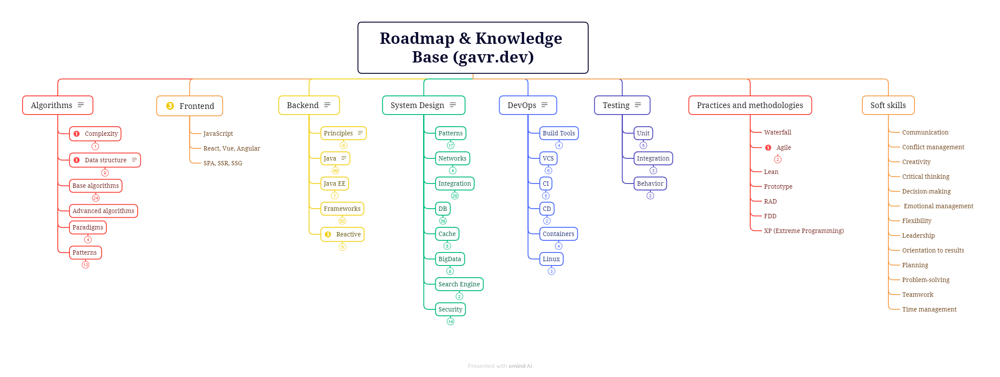

 <h1 align="center">Backend Developer Roadmap (Java)</h1>

List of skills in the form of a mindmap - https://xmind.ai/share/yf4P3Sbb?xid=YZbU3qLK
## Algorithms

> [!NOTE]
> **Courses:**
> - [Problems - LeetCode](https://leetcode.com/problemset/)
> - [Data Structures | AlgoExpert](https://www.algoexpert.io/data-structures)
> - [Data Structures for Coding Interviews in Java - AI-Powered Learning for Developers](https://www.educative.io/courses/data-structures-coding-interviews-java)
> - [Algorithms for Coding Interviews in Java - AI-Powered Learning for Developers](https://www.educative.io/courses/algorithms-coding-interviews-java)
> - [Grokking Coding Interview Patterns in Java - AI-Powered Learning for Developers](https://www.educative.io/courses/grokking-coding-interview-patterns-java)
### Topics

- Complexity
	- Big O
- Data structure
	- Array
	- Linked List
	- Stack
	- Queue
	- Graph
	- Tree
	- Trie
	- Heap
	- Hash table
- Base algorithms
	- Sort
		- Bubble Sort
		- Selection Sort
		- Insertion Sort
		- Merge Sort
		- Quick Sort
		- Heap Sort
		- Radix Sort
		- Counting Sort
	- Search
		- Linear Search
		- Binary Search
	- Graph
		- Traversal
			- Depth-First Search (DFS)
			- Breadth-First Search (BFS)
		- Shortest Path
			- Dijkstra’s algorithm
			- Bellman-Ford algorithm
			- A* search
		- Minimum Spanning Tree
			- Prim’s algorithm
			- Kruskal’s algorithm
		- Network Flow
- Advanced algorithms
- Paradigms
	- Brute Force
	- Greedy Algorithms
	- Divide and Conquer
	- Dynamic Programming
- Patterns 
	- Two Pointers
	- Fast and Slow Pointers
	- Sliding Window
	- Merge Intervals
	- In-place Reversal of a Linked List
	- Two Heaps
	- Top K Elements
	- Subsets
	- Greedy Techniques
	- Dynamic Programming
	- Backtracking
	- Matrices
	- Bitwise Manipulation
## Backend

> [!NOTE]
> **Books**
> - Refactoring: Improving the Design of Existing Code - Martin Fowler
> - Patterns of Enterprise Application Architecture - Martin Fowler
> - Clean Code - Robert Martin
> - The Clean Coder -  Robert Martin
> - Code Complete -  Steve McConnell
> - Working Effectively with Legacy Code -  Michael Feathers
> - The Pragmatic Programmer - David Thomas
>
> **Courses**
> - [Hyperskill](https://hyperskill.org/tracks)
> - [Курс - Java программист](https://job4j.ru/)

### Principles & Patterns

> [!NOTE]
> **Books**
> - Head First Design Patterns - Eric Freeman 
>
> **Resources**
> - [Refactoring and Design Patterns](https://refactoring.guru)
> - [https://www.geeksforgeeks.org/gang-of-four-gof-design-patterns](https://www.geeksforgeeks.org/gang-of-four-gof-design-patterns)/

#### Topics
- OOP
- SOLID
- KISS
- Design patterns (GoF)
- DDD
- Anti patterns

### Java Core

> [!NOTE]
> **Books**
> - Head first Java - Kathy Sierra
> - Core Java, Vol 1 & 2 - Horstmann 
> - Core Java for the Impatient - Horstmann
> - Effective Java - Joshua Bloch
> - Java Concurrency in Practice - Goetz,  Joshua Bloch
>
> **Documentation**
> - [JDK 21 Documentation - Home](https://docs.oracle.com/en/java/javase/21/index.html)
> - The Java Language Specification
> - The Java Virtual Machine Specification
> 
> **Courses**
>  - [Добро пожаловать | java-backend-learning-course](https://zhukovsd.github.io/java-backend-learning-course/)

#### Topics

**Base**
- Syntax
- DataTypes, Variables
- Conditionals
- DataStructures
- OOP, Interfaces, Classes
- Packages
- IO
	- File IO
	- Network IO
	- Sockets
	- NIO
- Loops
- Exception Handling
- Collections

**Intermediate**
- Serialization
- Generics
- Lambdas
- Stream API
- Data Time API
- Optional
- Sealed Class
- Record
- Concurrency
	- Thread, Runnable
	- volatile
	- synchronize
- Networking & Sockets

**Advanced**
- JVM, Heap, Stack
- GC
- Classloader
- Memory Managment (JMM)
- Concurrency
	- Atomic
	- Executors
	- ReentranceLock
	- Collections
	- Virtual threads
- Profiling
	- jconsole
	- jvisualvm
	- jProfiler
	- thread dump
	- heap dump

### Java EE

#### Topics

- Servlets
- JSP
- JMS
- Application Servers
	- Tomcat
	- Jetty
	- WildFly
### Frameworks

> [!NOTE]
> **Books**
> - "Spring in Action" series
> 
> **Documentation**
> - Official documentation
#### Topics
**Spring** 
 - Spring Core
     - Configuration
     - DI, IoC
     - AOP
     - Annotations
     - Bean Scope
     - Bean Factory
     - Application Context
 - Spring Boot
     - Starters  
     - Autoconfiguration
     - Actuators
     - Embedded Server
 - Spring MVC
     - Architecture
     - Components
 - Spring Data
     - Spring Data JPA
     - Spring Data JDBC
 - Spring Security
     - Authentification
     - Authorization
     - OAuth2
     - JWT
     - SAML
     - LDAP
    - Databases

**Databases**
 - JDBC
     - JDBI3  
     - JDBC Template
 - ORM/JPA
     - Hibernate
		  - ORM
		  - Persistence Context
		  - Relationships
		  - Lazy, Eager
		  - Entity Lifecycle
		  - Cache
	 - OpenJPA
 - JOOQ     
 - Liquibase/Flyway 

**Other**
- Logging 
	 - Log4j2
	 - Logback     
	 - SLF4J     
- Apache Spark 
- Utils 
	 - Guava     
	 - Apache Commons     
	 - Jackson 
	 - Quartz

### Reactive
- Flux  
- RXJava 
- Spring WebFlux   
- Vert.x    
- Akka

## System Design

> [!NOTE]
> **Books**
> - Designing Data-Intensive Applications - Kleppmann
> - Building Microservices - Sam Newman
> - Microservices Patterns - Chris Richardson
> - Implementing Domain-Driven Design - Vaughn Vernon
>
> **Courses**
> - [https://github.com/ByteByteGoHq/system-design-101](https://github.com/ByteByteGoHq/system-design-101)
> - [https://github.com/donnemartin/system-design-primer](https://github.com/donnemartin/system-design-primer) 
> - [https://www.educative.io/courses/grokking-modern-system-design-interview-for-engineers-managers](https://www.educative.io/courses/grokking-modern-system-design-interview-for-engineers-managers)
> - [https://www.educative.io/courses/distributed-systems-practitioners](https://www.educative.io/courses/distributed-systems-practitioners)
> - https://www.designgurus.io/course/grokking-the-advanced-system-design-interview
>
> **Sites**
> - [ByteByteGo | Technical Interview Prep](https://bytebytego.com)
### Topics

**Patterns**
- Enterprise Integration Patterns
- Monolithic
- Microservices
	- BFF
	- CQRS
	- Event sourcing
	- Circuit Breaker
	- Strangler Facade
	- Pub/Sub
	- Ambassador
	- Leader Election
- CAP
- Consistency
- SOA
- Serverless
- Service Mash
- Twelve Factor Apps

**Networks**
- Topologies
- DNS
- OSI & TCP/IP models
- Protocols

**Integration**
- Frameworks
	- Spring Integration
	- Apache Camel
- API
	- REST
		- HATEOAS
	- GraphQL
	- gRPC
	- SOAP
	- Websockets
	- Webhook
- Messaging
	- JMS
	- MQ
		- ActiveMQ
		- RabbitMQ
	- Kafka
- Proxy
	- Load Balancers
		- Nginx
		- HAProxy
	- Reverse Proxy
	- API Gateway
- Process management
	- BPM
	- BPEL
	- Activiti
	- Camunda

**DB**
- RDBMS
	- Core
		- DML & DDL
		- Transactions
		- ACID
		- Isolation
		- Normalization
		- N+1 problem
	- PostgreSQL
	- H2
- NoSQL
	- Document
		- MongoDB
		- CouchDB
	- Time Series
		- InfluxDB
		- TimeScale
	- Realtime
		- Firebase
		- RethingDB
	- Column
		- Cassandra
		- HBase
	- Key-Value
		- Redis
		- DynamoDB
	- Graph
		- Neo4J
- IMDG
	- Hazelcast
	- Apache Ignite
	- GridGane
- Scaling
	- Indexes
	- Replication
	- Sharding
	- Profiling
	- CAP theorem

**Cache**
- Client side
- CDN
- Server side
	- Redis
	- Memcached

**BigData**
- Hadoop
- HDFS
- Ozone
- S3
- Hive
- MapReduce
- Spark
- Oozie

**Search Engine**
- Elasticsearch
- Solr

**Security**
- Authentification
	- OAuth
	- Basic Auth
	- Token Auth
	- JWT
	- OpenID
	- SAML
- Hashing
	- MD5
	- SHA
	- scrypt/bcrypt
- SSL/TLS
- HTTPS
- API Security
## Frontend

### Topics
- JavaScript
- React, Vue, Angular
- SPA, SSR, SSG

## Testing

> [!NOTE]
> **Books**
> - Тестирование Дот Ком - Роман Савин

### Topics
- Unit
	- JUnit
	- Mockito
	- TestNG
	- PowerMock
	- TDD
- Integration
	- Cucumber
	- JMeter
	- Selenium
- Behavior
	- JBehave
	- BDD

## Practices and methodologies
- Waterfall
- Agile
	- Scrum
	- Kanban
- Lean
- Prototype
- RAD
- FDD
- XP (Extreme Programming)

## Soft skills
- Communication
- Conflict management
- Creativity
- Critical thinking
- Decision-making
- Emotional management
- Flexibility
- Leadership
- Orientation to results
- Planning
- Problem-solving
- Teamwork
- Time management

## DevOps

> [!NOTE]
> **Courses**
> - [DevOps Beginners to Advanced with Projects | Udemy](https://www.udemy.com/course/decodingdevops/)
### Topics
- Build Tools
	- Maven
	- Gradle
	- Ant
	- jShell
- VCS
	- Git
		- Github
		- Gitlab
		- Bitbucket
	- GitFlow
	- Trunk-based Development
- CI
	- Сoncepts
	- Jenkins
	- SonarQube
	- PMD, CheckStyle
	- JaCoCo
- CD
	- Сoncepts
	- Ansible
- Containers
	- Concepts
	- Docker
	- Docker Compose
	- K18s
- Linux
	- Core commands
	- OS Concepts
	- shell